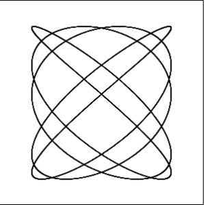
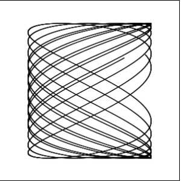
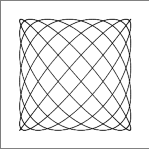
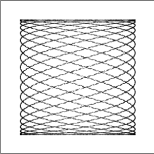
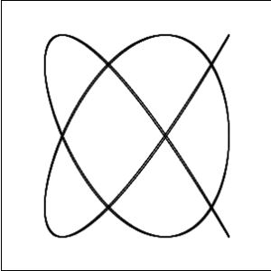

# Lissajous-curve
## About
Lissajous curve is the graph of a system of parametric equations x= A sin(a * t + c ),y= B sin( b t ).
More about Lissajous curve [here](https://en.wikipedia.org/wiki/Lissajous_curve)

## Examples

## Github pages
[You can see it here](https://catinbeard.github.io/Lissajous-curve/)